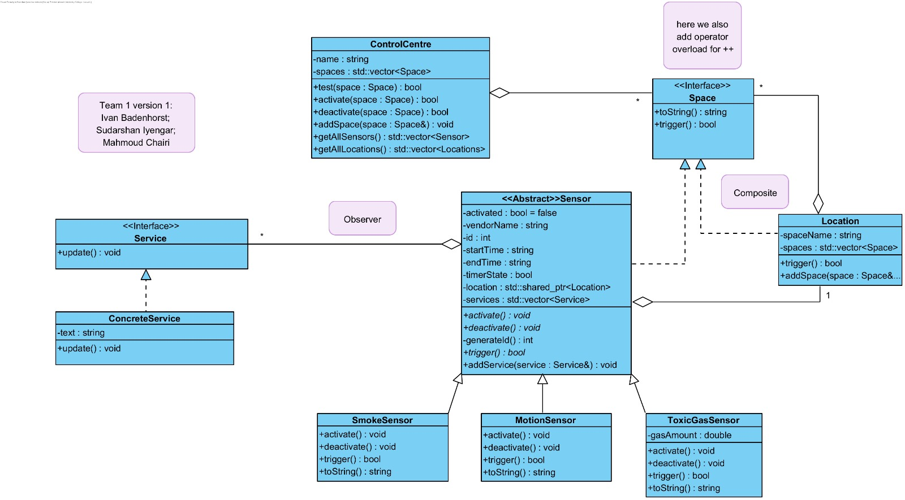

# Emergency Center Repo

## UML:
- The UML is as follows:
    

## Important note:
the timing of the sensors has been implemented using the system time. That may influence the result of the test scenarios, since a given sensor may not trigger -> simply because the current time is not within the time that the sensor is active.
In order to work around this, the sensors time dependence can be removed using the "void setTimeDependent(bool state)" function found in Sensor.h. If the value is set to false the sensor no longer depends on the time

